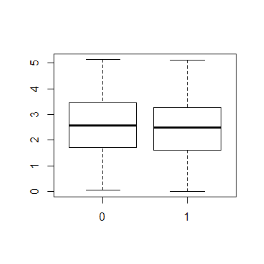
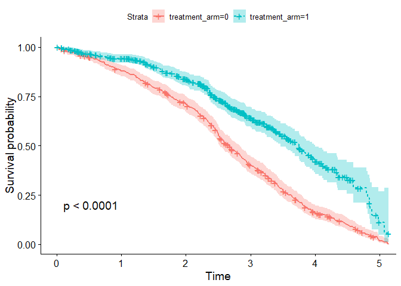

```r
library(tidyverse)    # Functions to help with data manipulation
library(lubridate)    # Functions to help handle dates
library(survival)    # Statistical package for analyzing survival data
library(survminer)
```

## Introduction

Cooties is a life-threatening pediatric illness. It primarily affects children and adolescents below the age of 15. The 5-year survival of cooties is about 25% if it is allowed to take its natural course. A new drug, COOTICURE, is being tested in clinical trials for efficacy in delaying death. In early clinical trials the therapy is proved quite effective, but only certain people benefited.

We will explore these data (in a completely statistically unsound way) using R, and see what we discover.

***

## Working in R


### Loading in the Data

Let's start by loading in the data from Excel.

The `read_csv()` command will read a '.csv' file (comma separated values) and automatically convert it to an R dataframe. A dataframe in R is like an Excel spreadsheet, but it tends to follow a very specific format.


In an R data frame:

* Each *observation* (e.g. study subject) corresponds to a *row*.

* Each *variable* (data about the subjects) corresponds to a *column*.

* The intersection between a row and a column is a *cell*.

* The value in a cell (eg., `id = 1` is referred to as an **element** or an **entry**.


```r
# When we begin a line with a '#', it means that we are writing a comment.
# Comments are only to communicate to other humans; they are ignored by the program!
cooties <- read_csv('cooties_data.csv')
```

We've stored the data in a dataframe called `cooties`

We can look at the first 10 data entries by *subsetting* or *slicing* the dataframe:

* The [ ] notation denotes that we are subsetting the dataframe `cooties`

* The '1:10' is denotes: "Take rows 1 to 10"

* The empty space after the comma denotes: "Take all of the columns" 

```r
cooties[1:10, ]
```

```
## # A tibble: 10 x 7
##       id   sex date_of_birth    treatment_arm trial_entrance death trial_exit
##    <int> <int> <chr>                    <int> <date>         <lgl> <date>    
##  1     1     1 November 25 2002             1 2012-04-23     FALSE 2012-08-19
##  2     2     0 December 28 2002             1 2012-01-26     FALSE 2015-03-09
##  3     3     1 November 25 2004             1 2011-12-12     TRUE  2012-08-15
##  4     4     1 June 13 1999                 0 2010-03-23     TRUE  2015-03-09
##  5     5     0 March 6 2005                 1 2012-09-11     TRUE  2015-03-09
##  6     6     1 January 3 2009               1 2010-05-25     FALSE 2010-09-06
##  7     7     0 August 17 2004               0 2010-08-18     TRUE  2010-12-06
##  8     8     0 January 2 2003               1 2010-06-18     FALSE 2014-10-08
##  9     9     1 July 15 2000                 1 2010-03-01     TRUE  2013-10-25
## 10    10     1 June 14 2001                 0 2012-02-16     TRUE  2014-11-18
```

### Data Dictionary

Variable names are limited, and sometimes its not clear what exactly they mean. To work with data, you often need a *data dictionary*. Here is one for you:

`id` Unique patient identification number. No two patients have the same `id`.

`sex` 0 is female, 1 is male

`date of birth` The patient's birthdate, provided (annoyingly) as a text field

`treatment_arm` 0 is placebo, and 1 is COOTICURE

`trial_entrance` The patient's start date in the trial

`death` TRUE if the patient died during the trial

`trial_exit` The patient's last follow-up in the trial

`trial_exit`. 1 If the patient died, and 0 otherwise.


***

### A Quick Introduction to the R tidyverse

The tidyverse is a collection of R packages that are designed for working with data. The tidyverse makes manipulating data easier because:

* Every function is designed to do one thing

* Every function has a consistent format, where the first argument is always a data frame and the output is always a data frame.

* The functions can be chained, rather than nested, which makes it more similar to English, and therefore easier to read. This will be explained later.

Some key tools that we will use from the tidyverse are below. You can learn more in-depth about the tidyverse <a href="https://www.datacamp.com/community/tutorials/tidyverse-tutorial-r">here</a>

***

#### `filter`

Keeps rows that meet certain conditions, and filters out the ones that don't. For example, we can filter the `cooties` data to only include Males in the Placebo treatment arm.

Note that the `cooties` dataframe itself doesn't actually change unless we re-assign the value using the `<-` operator.

```r
filter(cooties, sex == 1, treatment_arm == 0)
```

```
## # A tibble: 251 x 7
##       id   sex date_of_birth   treatment_arm trial_entrance death trial_exit
##    <int> <int> <chr>                   <int> <date>         <lgl> <date>    
##  1     4     1 June 13 1999                0 2010-03-23     TRUE  2015-03-09
##  2    10     1 June 14 2001                0 2012-02-16     TRUE  2014-11-18
##  3    18     1 January 1 2006              0 2012-12-26     TRUE  2014-11-03
##  4    20     1 April 10 2006               0 2011-12-24     TRUE  2013-07-26
##  5    27     1 January 3 2002              0 2012-11-21     TRUE  2013-09-25
##  6    35     1 February 3 2003             0 2010-01-03     TRUE  2011-10-11
##  7    38     1 August 19 2002              0 2012-10-13     TRUE  2015-03-09
##  8    41     1 May 11 2006                 0 2011-07-05     TRUE  2014-10-01
##  9    54     1 April 8 1998                0 2011-08-08     TRUE  2014-04-16
## 10    55     1 October 22 1999             0 2010-05-09     TRUE  2011-10-24
## # ... with 241 more rows
```

***

#### `select`

Allows you to select the columns that you provide as arguments, or remove columns if you put a `-` in front. For example, if we want to make a new data frame with only `id`, `sex` and `date_of_birth` we can type:

```r
select(cooties, id, sex, date_of_birth)
```

```
## # A tibble: 1,000 x 3
##       id   sex date_of_birth   
##    <int> <int> <chr>           
##  1     1     1 November 25 2002
##  2     2     0 December 28 2002
##  3     3     1 November 25 2004
##  4     4     1 June 13 1999    
##  5     5     0 March 6 2005    
##  6     6     1 January 3 2009  
##  7     7     0 August 17 2004  
##  8     8     0 January 2 2003  
##  9     9     1 July 15 2000    
## 10    10     1 June 14 2001    
## # ... with 990 more rows
```

But typing this produces the exact same results:

```r
select(cooties, -treatment_arm, -trial_entrance, -death, -trial_exit)
```

```
## # A tibble: 1,000 x 3
##       id   sex date_of_birth   
##    <int> <int> <chr>           
##  1     1     1 November 25 2002
##  2     2     0 December 28 2002
##  3     3     1 November 25 2004
##  4     4     1 June 13 1999    
##  5     5     0 March 6 2005    
##  6     6     1 January 3 2009  
##  7     7     0 August 17 2004  
##  8     8     0 January 2 2003  
##  9     9     1 July 15 2000    
## 10    10     1 June 14 2001    
## # ... with 990 more rows
```

***

#### `mutate`

Allows you to create new variables from old variables, effecively "mutating" the data frame. For example, we can make a new variable `years_in_trial` to describe how long the subject was followed. We do that by subtracting the end date (`trial_exit`) from the start date (`trial_entrance`).

Because we actually want to keep this change, we will use the assignment operator `<-` to overwrite `cooties`

```r
cooties <- mutate(cooties, years_in_trial = as.numeric(trial_exit - trial_entrance) / 365.25)
cooties
```

```
## # A tibble: 1,000 x 8
##       id   sex date_of_birth    treatment_arm trial_entrance death trial_exit years_in_trial
##    <int> <int> <chr>                    <int> <date>         <lgl> <date>              <dbl>
##  1     1     1 November 25 2002             1 2012-04-23     FALSE 2012-08-19          0.323
##  2     2     0 December 28 2002             1 2012-01-26     FALSE 2015-03-09          3.12 
##  3     3     1 November 25 2004             1 2011-12-12     TRUE  2012-08-15          0.676
##  4     4     1 June 13 1999                 0 2010-03-23     TRUE  2015-03-09          4.96 
##  5     5     0 March 6 2005                 1 2012-09-11     TRUE  2015-03-09          2.49 
##  6     6     1 January 3 2009               1 2010-05-25     FALSE 2010-09-06          0.285
##  7     7     0 August 17 2004               0 2010-08-18     TRUE  2010-12-06          0.301
##  8     8     0 January 2 2003               1 2010-06-18     FALSE 2014-10-08          4.31 
##  9     9     1 July 15 2000                 1 2010-03-01     TRUE  2013-10-25          3.65 
## 10    10     1 June 14 2001                 0 2012-02-16     TRUE  2014-11-18          2.75 
## # ... with 990 more rows
```

You also have the option to overwrite variables by replacing the name, as in:

```r
mutate(cooties, sex = ifelse(sex == 1, 'Male', 'Female'))


# Note:
# The `ifelse()` function checks each observation to see if it meets a
# condition. Here the condition is that `sex == 1`
# IF it is True: It will return the value 'Male'. 
# ELSE (i.e., it is False): It will return the value 'Female'
```

```
## # A tibble: 1,000 x 8
##       id sex    date_of_birth    treatment_arm trial_entrance death trial_exit years_in_trial
##    <int> <chr>  <chr>                    <int> <date>         <lgl> <date>              <dbl>
##  1     1 Male   November 25 2002             1 2012-04-23     FALSE 2012-08-19          0.323
##  2     2 Female December 28 2002             1 2012-01-26     FALSE 2015-03-09          3.12 
##  3     3 Male   November 25 2004             1 2011-12-12     TRUE  2012-08-15          0.676
##  4     4 Male   June 13 1999                 0 2010-03-23     TRUE  2015-03-09          4.96 
##  5     5 Female March 6 2005                 1 2012-09-11     TRUE  2015-03-09          2.49 
##  6     6 Male   January 3 2009               1 2010-05-25     FALSE 2010-09-06          0.285
##  7     7 Female August 17 2004               0 2010-08-18     TRUE  2010-12-06          0.301
##  8     8 Female January 2 2003               1 2010-06-18     FALSE 2014-10-08          4.31 
##  9     9 Male   July 15 2000                 1 2010-03-01     TRUE  2013-10-25          3.65 
## 10    10 Male   June 14 2001                 0 2012-02-16     TRUE  2014-11-18          2.75 
## # ... with 990 more rows
```

***

#### `separate`

Allows you to separate a single column into multiple columns based on a "separator"

For example, we can split up the `date_of_birth` column into three different columns of `dob_month`, `dob_day`, and `dob_year`.


```r
# If your function is very long, it is easier to read if you separate each
# argument onto a separate line
separate(cooties, 
         col = date_of_birth, 
         into = c('dob_month', 'dob_day', 'dob_year'),
         sep = ' ',    # The 'separator' is a space (as in spacebar)
         remove = TRUE)    # remove = TRUE will remove the original variable

# Note:
# `c()` means 'concatenate'; it is how you attach multiple objects together as
# a single object. Try: 1 + c(1, 2, 3)
```

```
## # A tibble: 1,000 x 10
##       id   sex dob_month dob_day dob_year treatment_arm trial_entrance death trial_exit years_in_trial
##    <int> <int> <chr>     <chr>   <chr>            <int> <date>         <lgl> <date>              <dbl>
##  1     1     1 November  25      2002                 1 2012-04-23     FALSE 2012-08-19          0.323
##  2     2     0 December  28      2002                 1 2012-01-26     FALSE 2015-03-09          3.12 
##  3     3     1 November  25      2004                 1 2011-12-12     TRUE  2012-08-15          0.676
##  4     4     1 June      13      1999                 0 2010-03-23     TRUE  2015-03-09          4.96 
##  5     5     0 March     6       2005                 1 2012-09-11     TRUE  2015-03-09          2.49 
##  6     6     1 January   3       2009                 1 2010-05-25     FALSE 2010-09-06          0.285
##  7     7     0 August    17      2004                 0 2010-08-18     TRUE  2010-12-06          0.301
##  8     8     0 January   2       2003                 1 2010-06-18     FALSE 2014-10-08          4.31 
##  9     9     1 July      15      2000                 1 2010-03-01     TRUE  2013-10-25          3.65 
## 10    10     1 June      14      2001                 0 2012-02-16     TRUE  2014-11-18          2.75 
## # ... with 990 more rows
```

This is a rather contrived example, but the `separate` function is often very useful when there are unwanted symbols (e.g., lab results reported like: 3.0ug/mL) or for cleaning up dates that are in non-standard formats.


***

#### `%>%`

This weird-looking thing is the 'pipe' or 'chain' operator. As mentioned above, the tidyverse supports chaining, which makes code much much easier to read. Chaining takes the *output* of the last function and uses it as the *input* for the next function (specifically, it is used as the first argument of the next function).

Compare these two code snippets that perform identical steps. Which is easier to follow? 

With Chaining:

```r
# Note the manipulations I am doing in these snippets are useless; it is just to illustrate the point

cooties %>% 
    filter(death == TRUE) %>%
    select(-sex) %>%
    mutate(treatment_arm = ifelse(treatment_arm == 1, 'Cooticure', 'Placebo'))
```

```
## # A tibble: 644 x 7
##       id date_of_birth    treatment_arm trial_entrance death trial_exit years_in_trial
##    <int> <chr>            <chr>         <date>         <lgl> <date>              <dbl>
##  1     3 November 25 2004 Cooticure     2011-12-12     TRUE  2012-08-15          0.676
##  2     4 June 13 1999     Placebo       2010-03-23     TRUE  2015-03-09          4.96 
##  3     5 March 6 2005     Cooticure     2012-09-11     TRUE  2015-03-09          2.49 
##  4     7 August 17 2004   Placebo       2010-08-18     TRUE  2010-12-06          0.301
##  5     9 July 15 2000     Cooticure     2010-03-01     TRUE  2013-10-25          3.65 
##  6    10 June 14 2001     Placebo       2012-02-16     TRUE  2014-11-18          2.75 
##  7    11 January 2 1997   Placebo       2012-06-13     TRUE  2013-09-04          1.23 
##  8    16 May 12 1999      Cooticure     2012-11-16     TRUE  2014-12-03          2.05 
##  9    18 January 1 2006   Placebo       2012-12-26     TRUE  2014-11-03          1.85 
## 10    19 November 24 2006 Cooticure     2012-10-12     TRUE  2015-02-23          2.37 
## # ... with 634 more rows
```

Without chaining (i.e., "nested")

```r
mutate(
    select(
        filter(cooties, death == TRUE), 
        -sex), 
    treatment_arm = ifelse(treatment_arm == 1, 'Cooticure', 'Placebo'))
```

```
## # A tibble: 644 x 7
##       id date_of_birth    treatment_arm trial_entrance death trial_exit years_in_trial
##    <int> <chr>            <chr>         <date>         <lgl> <date>              <dbl>
##  1     3 November 25 2004 Cooticure     2011-12-12     TRUE  2012-08-15          0.676
##  2     4 June 13 1999     Placebo       2010-03-23     TRUE  2015-03-09          4.96 
##  3     5 March 6 2005     Cooticure     2012-09-11     TRUE  2015-03-09          2.49 
##  4     7 August 17 2004   Placebo       2010-08-18     TRUE  2010-12-06          0.301
##  5     9 July 15 2000     Cooticure     2010-03-01     TRUE  2013-10-25          3.65 
##  6    10 June 14 2001     Placebo       2012-02-16     TRUE  2014-11-18          2.75 
##  7    11 January 2 1997   Placebo       2012-06-13     TRUE  2013-09-04          1.23 
##  8    16 May 12 1999      Cooticure     2012-11-16     TRUE  2014-12-03          2.05 
##  9    18 January 1 2006   Placebo       2012-12-26     TRUE  2014-11-03          1.85 
## 10    19 November 24 2006 Cooticure     2012-10-12     TRUE  2015-02-23          2.37 
## # ... with 634 more rows
```


***

### Exploring Data with R

R is also a very useful for data analysis because of how quickly you can summarize data. You can get descriptive statistics and visualizations very easily to help understand your data.

Let's look at a few examples:

***

`dim` stands for 'dimensions'. It let's us summarize the dimensions of out data frame so we now how big our dataset is. It outputs the number of rows (how many observations you have) and the number of columns (how many variables you have).

```r
dim(cooties)
```

```
## [1] 1000    8
```

***

`mean` calculates the mean (as one might expect). `median` and `mode` are also avilable.

`$` (*dollar*) an operator that selects a variable from a dataframe, i.e., *From the data frame `cooties`, select the variable `sex`*. You can think of it as a short-hand way of writing `select(cooties, sex)` (though it is not *exactly* the same)


```r
mean(cooties$sex)
# Since sex is a binary variable (1 being male, 0 being female), we can quickly
# calculate the proportion of males by taking the mean. Here it is about 50%.
```

```
## [1] 0.498
```

***

`summary` outputs a whole bunch of useful descriptive statistics that help describe the distribution of the variable.

```r
summary(cooties$years_in_trial)
```

```
##     Min.  1st Qu.   Median     Mean  3rd Qu.     Max. 
## 0.008214 1.644764 2.525667 2.504695 3.364819 5.138946
```

***

`hist` plots a histogram. A histogram allows you to see the distribution of your data---it plots how frequent each of the values are. This is a painstaking process in Excel, but is done in one line in R.

```r
hist(cooties$years_in_trial)
```

<!-- -->


***

`boxplot` plots a boxplot, which is another way that you can visualize the distribution of your data. Boxplots are particularly useful for visually comparing two distributions. For example, we can look at the differences between males and females in terms of their length on the trial.

Note: The `y ~ x` notation is called a "formula". It is not necessary to fully understand this now, but here is how it works: R interprets `years_in_trial` as the response variable (i.e., the *dependent variable*), and `cooties$sex` as a predictor (i.e., an *independent variable*). Formulas are used a lot in statistical modeling functions to communicate what variable we are trying to estimate in the model and what variables we want to use to help estimate it. You can learn more <a href="http://www.dummies.com/programming/r/how-to-use-the-formula-interface-in-r/">here</a>.


```r
boxplot(cooties$years_in_trial ~ cooties$sex)
```

<!-- -->


These quick plots get the job done, but it's not pleasing to the eye. In later sessions, we will go over how to create more professional-looking plots.


### Survival Analysis
 
Create a model for `death ~ treatment_arm`
 

```r
survival <- survfit(
  Surv(time = years_in_trial, event = death) ~ treatment_arm,
  data = cooties
  )
```


```r
ggsurvplot(survival,
           linetype = 'strata',
           conf.int = T,
           pval = T)
```

<!-- -->

The effect of `sex` within the treatment arm


```r
survival <- survfit(
  Surv(time = years_in_trial, event = death) ~ sex,
  data = filter(cooties, treatment_arm == 1)
  )
```


```r
ggsurvplot(survival,
           linetype = 'strata',
           conf.int = T,
           pval = T)
```

<!-- -->

What other interesting trends exist in the data?

